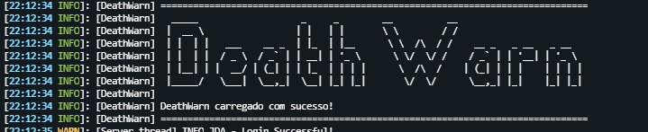
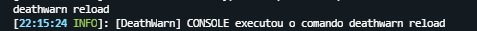
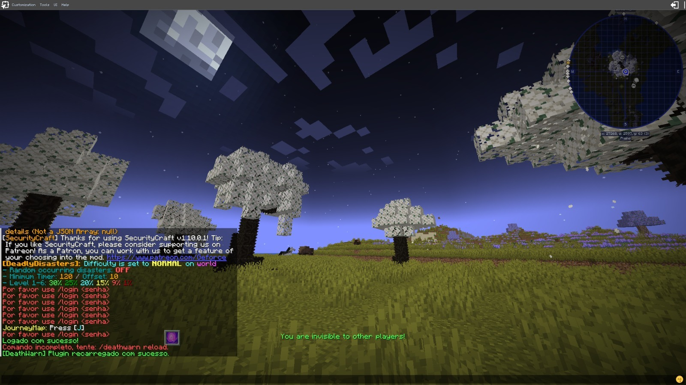
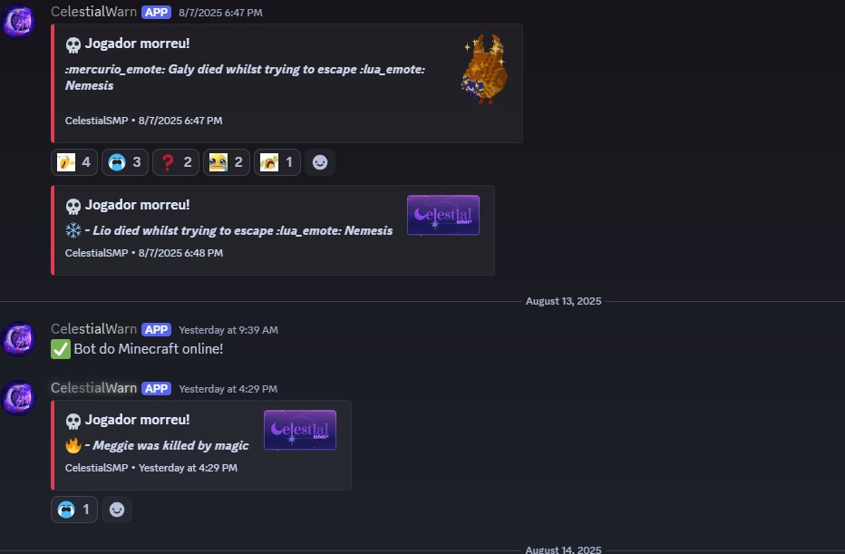

# 💀 DeathWarn Plugin

Um plugin para **servidores Minecraft Mohist (1.20.1)** que envia mensagens de morte personalizadas para o **Discord** via bot.

---

## 🚀 Funcionalidades
- Detecta mortes de jogadores no servidor.
- Envia mensagens estilizadas em **embeds do Discord**.
- Suporte a imagens personalizadas por grupo (`planeta` via LuckPerms).
- Comando `/deathwarn reload` para recarregar as configurações sem reiniciar o servidor.

---

## 📸 Exemplos
Start do plugin no painel:

Execução do comando reload via console:

Execução do comando reload in game:

Mensagem enviada ao Discord quando um jogador do grupo **planeta** morre:

---

## 🔧 Requisitos
- Servidor **Mohist 1.20.1** (ou outro compatível com Spigot + Forge).
- **Java 17+**.
- Plugins recomendados:
  - [LuckPerms](https://luckperms.net/)
  - [TAB](https://www.spigotmc.org/resources/tab-1-5-x-1-20-x.57806/)

---

## ▶️ Como instalar
1. Baixe a versão mais recente em [Releases](../../releases).
2. Coloque o arquivo `.jar` na pasta `plugins/` do seu servidor.
3. Inicie o servidor para gerar os arquivos de configuração.
4. Configure seu token do Discord, ID do Canal e imagens no `config.properties`, `imagens.yml`, respectivamente.

---

## 📦 Releases
👉 [Baixar a última versão](../../releases/latest)

---

## 👨‍💻 Desenvolvimento
Este projeto é feito em **Java + Kotlin + Gradle (Kotlin DSL)**. 
